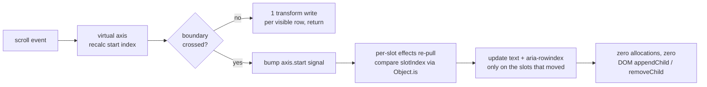
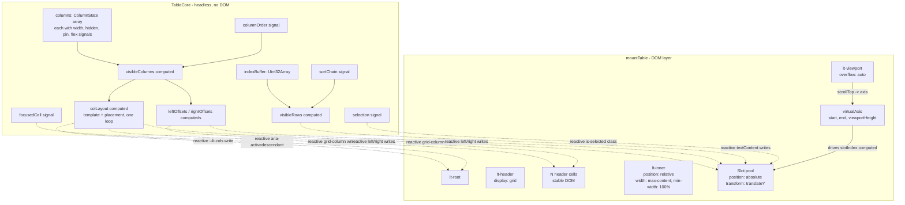
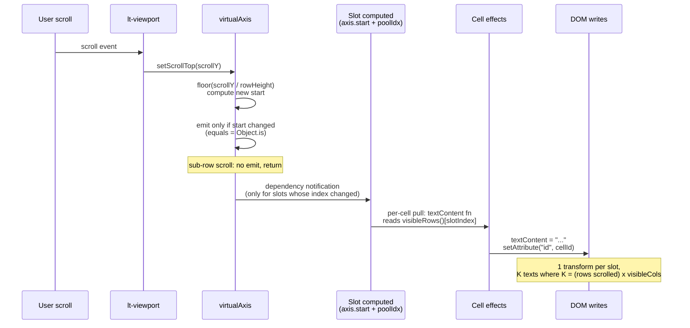
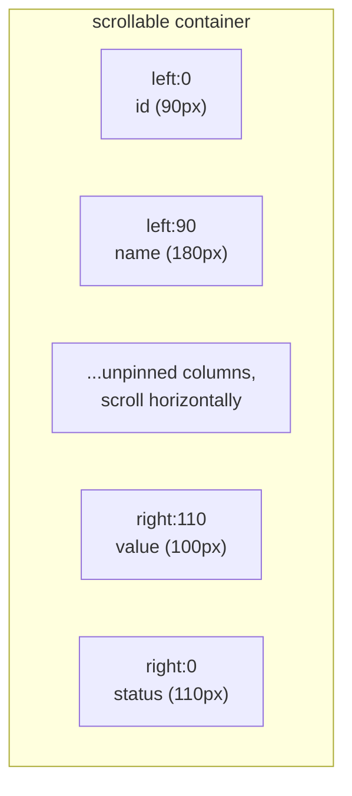

# @zakkster/lite-table

> Zero-GC virtual data grid. Slot-recycled DOM, position-keyed reactivity, single-allocation sort. Built for 100k-row scrolls on the same 16ms frame budget that runs the rest of your UI.

[](https://www.npmjs.com/package/@zakkster/lite-table)
[](https://github.com/sponsors/PeshoVurtoleta)

[](https://bundlephobia.com/result?p=@zakkster/lite-table)
[](https://www.npmjs.com/package/@zakkster/lite-table)
[](https://www.npmjs.com/package/@zakkster/lite-table)
[](https://github.com/PeshoVurtoleta/lite-signal)


[](./LICENSE.txt)

```bash
npm install @zakkster/lite-table \
            @zakkster/lite-signal \
            @zakkster/lite-virtual \
            @zakkster/lite-signal-dom
```

```js
import { createTable, mountTable } from "@zakkster/lite-table";

const table = createTable({
    rows: bigDataset,                          // any [] of objects, including 1M+
    columns: [
        { key: "id",    width: 90  },
        { key: "name",  width: 220, flex: 1 },
        { key: "email", width: 280, flex: 2 },
        { key: "value", width: 120, compare: (a, b) => a - b }
    ],
    getRowId: (row) => row.id
});

mountTable(document.getElementById("host"), table);
```

Synchronous, virtual, allocation-free in the steady state. A 100,000-row scroll touches **zero** new signal nodes, **zero** new DOM elements, and writes one `transform: translateY(...)` per visible row per boundary cross.

---

## Table of contents

- [Why this exists](#why-this-exists)
- [What you get](#what-you-get)
- [The case for slot recycling](#the-case-for-slot-recycling)
- [Architecture in one diagram](#architecture-in-one-diagram)
- [How a scroll propagates](#how-a-scroll-propagates)
- [API reference](#api-reference)
- [Export](#export)
- [Cell editing](#cell-editing)
- [Per-column filtering](#per-column-filtering)
- [Pinning and sticky offsets](#pinning-and-sticky-offsets)
- [Flex columns](#flex-columns)
- [Sorting](#sorting)
- [Selection](#selection)
- [Keyboard navigation](#keyboard-navigation)
- [Capacity, growth, and the signal-registry ceiling](#capacity-growth-and-the-signal-registry-ceiling)
- [Benchmarks](#benchmarks)
- [Testing strategy](#testing-strategy)
- [What this is not](#what-this-is-not)
- [Ecosystem](#ecosystem)
- [Browser and runtime support](#browser-and-runtime-support)
- [Integration recipes](#integration-recipes)
- [FAQ](#faq)

---

## Why this exists

Data grids are the worst case for a UI framework. A million rows are common. Scrolling fires hundreds of events per second. Sorts produce N-row reorders. Pinned columns cross every layout pass. Almost every grid library on npm collapses on one of these.

`lite-table` was built under four constraints simultaneously:

1. **No allocation while scrolling.** A 100k-row table at 120fps cannot allocate. Steady-state scrolling touches no heap.
2. **Constant DOM topology.** The DOM tree is built once at mount and never modified again. No rows are added or removed during scroll, sort, filter, or column reorder. Cells are recycled in place.
3. **Reactivity that doesn't fan out.** Every cell subscribes to its own row index and column key -- not the whole row, not the whole dataset. A single-cell update touches one effect.
4. **Headless core + thin DOM mount.** The same `TableCore` runs in tests under `happy-dom` and in production under Chrome. The DOM layer is one file, optional, replaceable.

The result is a grid where the cost of *being a 1,000,000-row table* and the cost of *being a 1,000-row table* are within noise of each other.



No microtask between `A` and `H`. No reconciliation. No diffing. Just version-stamped pulls through the reactive graph.

---

## What you get

- **`createTable(config)`** -- headless `TableCore`. Reactive columns, visible rows, sort, selection, focused cell. Pure data, no DOM.
- **`mountTable(host, table, options?)`** -- DOM mount. Builds a fixed slot pool, header bar, viewport, attaches all reactive bindings, returns `{ root, dispose }`.
- **`createTable` accepts** rows (array or getter), columns, `getRowId`, `rowHeight`, `overscan`, `initialFocus`, `initialSort`.
- **Reactive surface:** `visibleRows`, `rowCount`, `visibleColumns`, `displayIndexByKey`, `colTemplate`, `colPlacement`, `contentWidth`, `leftOffsets`, `rightOffsets`, `sortChain`, `focusedCell`, `selection`, `selectionAnchor`.
- **Methods:** `setSort`, `addSort`, `toggleSort`, `clearSort`, `setColumnWidth`, `setColumnHidden`, `setColumnPin`, `setColumnFlex`, `setColumnOrder`, `moveColumn`, `selectRow`, `selectRowRange`, `selectAll`, `clearSelection`, `isSelected`, `moveFocus`, `cellId`, `dispose`.
- **Per-column state:** every `ColumnState` exposes `width`, `hidden`, `pin`, `flex` as signals -- wire them directly to your own UI controls.

Full type definitions ship in [`Table.d.ts`](./Table.d.ts) and are referenced from `package.json`. Every public symbol has JSDoc.

---

## The case for slot recycling

<details>
<summary>Why a fixed DOM pool: the per-scroll allocation table, and why diffing loses here.</summary>

A naive virtual grid builds rows from a `visibleRowSlice` array. The grid library compares old slice vs new slice, calls `insertBefore` / `removeChild` for the difference. With overscan = 4 and `rowHeight = 32`, a moderately fast scroll touches ~10 rows per frame; each row is a freshly-allocated DOM tree of `1 + N` elements (row + cells). 600 DOM nodes per second isn't catastrophic in isolation, but combined with the cell-content allocations (text nodes, span wrappers), the garbage collector will pause inside your scroll handler.

`lite-table` solves this by **never adding or removing rows after mount**. The viewport contains a fixed pool of `ceil(viewportHeight / rowHeight) + overscan * 2 + 1` row elements. Each pool slot has a stable index from `0` to `pool.length - 1`. The slot's `position: absolute; transform: translateY(rowIndex * rowHeight)` does all the visual work.

| Scroll event             | DOM allocations | DOM updates              | Notes                                                    |
| ------------------------ | --------------- | ------------------------ | -------------------------------------------------------- |
| Sub-row scroll (< 32px)  | **0**           | **0**                    | Boundary not crossed, no slot moves                       |
| Boundary cross (1 row)   | **0**           | **N transforms**         | One transform per pool slot                               |
| Boundary cross (10 rows) | **0**           | **N transforms + <=NxC text writes** | Only the slots whose `slotIndex` changed re-pull text |
| Sort                     | **0**           | **NxC text writes**      | All visible cells re-read from the resorted index buffer  |
| Column resize            | **0**           | **1 style write**        | Updates `--lt-cols` on root; CSS handles the rest         |
| Column reorder           | **0**           | **N style writes**       | `gridColumn` per visible cell; no nodes touched           |

The pool is sized to the *viewport*, not the dataset. Switching from a 1,000-row table to a 1,000,000-row table changes the pool size by zero. Memory footprint is `O(viewport)`, not `O(rows)`.

</details>

---

## Architecture in one diagram

<details>
<summary>The split between core and mount, the slot pool, and where reactivity flows.</summary>



Every binding from `Core` to `Mount` is one effect per (slot, cell) pair, created at mount and never re-created. There are no diffing passes. There is no reconciler. A signal write propagates through the reactive graph and lands on `setAttribute`, `style.transform`, or `textContent` -- nothing else.

</details>

---

## How a scroll propagates

<details>
<summary>The scroll right axis right slotIndex right cell pull sequence, and why Object.is on the slot index is the whole optimization.</summary>



The trick is **`Object.is` on the slot's truncated row index**. Each slot is a computed that returns `axis.start() + poolIdx`. When the user scrolls 12 pixels and `rowHeight` is 32, `axis.start()` doesn't change -- `Object.is` short-circuits the computed propagation and zero cells re-pull. When the user scrolls 32 pixels (one row), only the *one* slot whose index now points to a different row re-pulls its text.

This is also why selection updates are free: clicking a row sets `selection` (a `Set`), the per-row `bindClass` effect re-runs, the row's `is-selected` class flips. No siblings touched, no parents touched, no scroll reflow.

The pull is **fully synchronous**, inherited from `@zakkster/lite-signal`. No microtask, no `requestAnimationFrame`, no scheduler queue.

</details>

---

## API reference

### Top-level

```ts
import {
  createTable, mountTable,
  // types only:
  type TableCore, type TableMount,
  type ColumnDef, type ColumnState,
  type PinSide, type SortEntry,
  type CellId, type SelectionMode
} from "@zakkster/lite-table";
```

### `createTable(config)` right `TableCore`

```ts
const table = createTable({
  rows: Row[] | (() => Row[]),
  columns: ColumnDef[],
  getRowId: (row: Row) => string | number,
  rowHeight?: number,         // default 32
  overscan?: number,          // default 4
  initialFocus?: CellId | null,
  initialSort?: SortEntry[]
});
```

Builds a headless reactive grid. No DOM is touched. Suitable for tests, server-side row-count derivation, or driving a non-DOM renderer (canvas, WebGL).

`rows` can be a plain array or a zero-arg getter; the getter form makes the row source reactive (e.g. `() => filtered()` where `filtered` is a computed).

### `mountTable(host, table, options?)` right `TableMount`

```ts
const mount = mountTable(host, table, {
  initialViewportHeight?: number  // default 480, used until ResizeObserver fires
});

// mount.root          -> HTMLDivElement (the lt-root)
// mount.dispose()     -> tear down all bindings; rebuild-safe
```

Builds the DOM, creates the fixed slot pool, attaches every reactive binding. Re-mounts are safe: `dispose()` returns every signal node and DOM element to a clean state.

### `ColumnDef`

```ts
interface ColumnDef {
  key: string;                         // unique within columns
  header?: string;                     // display label (default: key)
  width?: number;                      // default 120
  minWidth?: number;                   // resize floor (default 40)
  maxWidth?: number;                   // resize ceiling (default 1600)
  hidden?: boolean;                    // initially hidden
  pin?: "left" | "none" | "right";     // initial pin side
  flex?: number;                       // 0 = fixed, >0 = share leftover space (see Flex columns)
  sortable?: boolean;                  // default true
  resizable?: boolean;                 // default true
  pinnable?: boolean;                  // default true
  hideable?: boolean;                  // default true
  reorderable?: boolean;               // default true
  accessor?: (row) => any;             // default row[key]
  compare?: (a, b) => number;          // default null-safe numeric/string
}
```

### `ColumnState`

```ts
interface ColumnState {
  // static
  readonly key: string;
  readonly header: string;
  readonly minWidth: number;
  readonly maxWidth: number;
  readonly sortable: boolean;
  readonly resizable: boolean;
  readonly pinnable: boolean;
  readonly hideable: boolean;
  readonly reorderable: boolean;
  readonly accessor: ((row) => any) | null;
  readonly compare: (a, b) => number;

  // reactive
  readonly width:  Signal<number>;
  readonly hidden: Signal<boolean>;
  readonly pin:    Signal<"left" | "none" | "right">;
  readonly flex:   Signal<number>;
}
```

These are live signals. `column.width.set(160)` updates the CSS template, the sticky offset map, and every cell in the column in one synchronous pass.

### Reactive surface on `TableCore`

```ts
table.columns              // ColumnState[]
table.rowsGetter()         // current row source
table.visibleRows()        // Computed<Row[]>  -- sort applied
table.rowCount()           // Computed<number>
table.columnOrder()        // Signal<string[]>
table.visibleColumns()     // Computed<ColumnState[]>
table.displayIndexByKey()  // Computed<Map<key, 0-indexed display pos>>
table.colTemplate()        // Computed<string>   -- grid-template-columns
table.colPlacement()       // Computed<Map<key, 1-indexed grid-column>>
table.contentWidth()       // Computed<number>   -- sum of widths
table.leftOffsets()        // Computed<Map<key, cumulative left px>>
table.rightOffsets()       // Computed<Map<key, cumulative right px>>
table.sortChain()          // Signal<SortEntry[]>
table.focusedCell()        // Signal<CellId | null>
table.selection()          // Signal<Set<RowId>>
table.selectionAnchor()    // Signal<RowId | null>
```

All `()` calls are tracked reads -- `effect(() => log(table.rowCount()))` will re-run whenever the row source changes.

### Methods

```ts
// Sort
table.setSort(entries)                    // replace chain
table.addSort(key, dir?)                  // append (or rotate existing entry)
table.toggleSort(key, { additive? })      // click handler with shift-chain
table.clearSort()

// Columns
table.setColumnWidth(key, w)              // clamps to min/max
table.setColumnHidden(key, hidden)
table.setColumnPin(key, side)
table.setColumnFlex(key, flex)            // 0 = fixed, >0 = share leftover
table.setColumnOrder(keys[])              // rejects non-permutations
table.moveColumn(fromKey, toKey, { before? })

// Selection
table.selectRow(rowId, mode)              // "single" | "toggle" | "additive"
table.selectRowRange(fromRowId, toRowId)
table.selectAll()
table.clearSelection()
table.isSelected(rowId)

// Focus
table.moveFocus(direction)                // "up" | "down" | "left" | "right" | "home" | "end" | "pageUp" | "pageDown"
table.cellId(rowId, columnKey)            // stable string id (matches DOM)

// Filters (M2)
table.setColumnFilter(key, value)         // null/""/whitespace clears that column
table.clearColumnFilters()                // clear all
table.columnFilters()                     // ReadonlyMap<string, string>
table.filteredRows()                      // computed: rows post-filter, pre-sort

// Editing (M2)
table.startEdit(rowId, columnKey)         // no-op on non-editable columns
table.commitEdit()                        // reads editingDraft
table.commitEdit(explicitValue)           // commit a specific value
table.cancelEdit()                        // discard; no onCellEdit call
table.isEditing(rowId, columnKey)         // O(1) predicate
table.editingCell()                       // { rowId, columnKey } | null
table.editingDraft()                      // current in-progress string

// Export (M1.1)
table.exportCsv({ rows?, columns?, delimiter?, quote?, headers?, newline?, bom?, formatter? })   // → string
table.exportJson({ rows?, columns?, indent?, format?, formatter? })                              // → string | object[]

// Lifecycle
table.dispose()
```

---

## Export

`exportCsv` and `exportJson` materialize a row source into a string (or, for JSON, an array). Both methods take the same `rows` and `columns` selectors plus their own format-specific options.

### `rows` source

| Value         | Meaning                                                                          |
| ------------- | -------------------------------------------------------------------------------- |
| `"visible"`   | The current `visibleRows()`. Honors sort + the row source (post-pagination view). **Default.** |
| `"all"`       | `rowsGetter()` -- the raw source you gave to `createTable`. If you gave a function (paginated source), this is the current page, NOT the master. See pitfall below. |
| `"selected"`  | The current selection materialized against `rowsGetter()`. Same caveat as `"all"`. |
| `Array`       | An explicit row array (e.g. a master array held externally).                     |

**Paginated-getter pitfall**: if `createTable({ rows: () => allRows.slice(...) })` is a paginated function, `"all"` and `"selected"` resolve against that function -- which returns only the current page. To export beyond the page, pass the master array explicitly:

```js
table.exportCsv({ rows: allRows });                          // entire master
table.exportCsv({ rows: table.selectedRows(allRows) });      // selected across master
```

### `columns` selector

| Value           | Meaning                                                          |
| --------------- | ---------------------------------------------------------------- |
| `"visible"`     | `visibleColumns()` -- honors hide state + current order. **Default.** |
| `"all"`         | All declared columns in declaration order, including hidden.     |
| `Array<string>` | Explicit projection by key. Order in the output matches array order. Unknown keys are silently dropped. |

### `exportCsv` options

| Option       | Type                       | Default   | Notes                                          |
| ------------ | -------------------------- | --------- | ---------------------------------------------- |
| `delimiter`  | `string`                   | `","`     | `"\t"` for TSV, `";"` for European regional    |
| `quote`      | `string`                   | `'"'`     | Per RFC 4180; embedded quotes are doubled      |
| `headers`    | `boolean`                  | `true`    | Emit header row                                |
| `newline`    | `string`                   | `"\r\n"`  | RFC 4180 says CRLF; `"\n"` works for most consumers |
| `bom`        | `boolean`                  | `false`   | Prepend UTF-8 BOM for Excel-on-Windows         |
| `formatter`  | `(row, col) => unknown`    | -         | Per-cell formatter, runs before CSV escaping   |

CSV escaping follows RFC 4180: a field is quoted if it contains the delimiter, the quote character, CR, or LF. Embedded quotes are doubled. The column's `accessor` (if any) is honored.

### `exportJson` options

| Option      | Type                       | Default      | Notes                                                            |
| ----------- | -------------------------- | ------------ | ---------------------------------------------------------------- |
| `indent`    | `number`                   | `0`          | `JSON.stringify` indent; 0 = single-line compact                 |
| `format`    | `"string"` \| `"array"`    | `"string"`   | `"array"` skips JSON.stringify and returns the projected array   |
| `formatter` | `(row, col) => unknown`    | -            | Per-cell formatter                                               |

Fast path: `exportJson({ columns: "all", format: "array" })` with no formatter returns a shallow `rows.slice()` -- the row objects themselves, not copies. Use this when piping into IndexedDB / postMessage / structured clone.

### Triggering a browser download

The methods return strings; the consumer handles the download:

```js
function downloadFile(text, filename, mime) {
    const blob = new Blob([text], { type: mime });
    const url = URL.createObjectURL(blob);
    const a = document.createElement("a");
    a.href = url;
    a.download = filename;
    document.body.appendChild(a);
    a.click();
    document.body.removeChild(a);
    URL.revokeObjectURL(url);
}

downloadFile(table.exportCsv({ bom: true }), "data.csv", "text/csv;charset=utf-8");
```

The BOM (`bom: true`) is the difference between Excel opening your file as UTF-8 vs garbling non-ASCII characters on Windows.

---

## Cell editing

Opt-in per column via `editable: true`. When set, double-click (or `F2` / `Enter` on the focused cell) puts the cell into `contenteditable` mode with its current value pre-selected. Enter commits, Tab commits + moves to the next cell, Escape cancels.

```js
const table = createTable({
    rows,
    columns: [
        { key: "id", width: 60 },
        { key: "name", editable: true },
        { key: "email", editable: true },
        { key: "joined" },                  // not editable -- no double-click affordance
    ],
    getRowId: r => r.id,
    onCellEdit: ({ row, columnKey, oldValue, newValue }) => {
        // Mutate the row, send to backend, dispatch to a store, whatever.
        // lite-table does NOT mutate the row for you.
        row[columnKey] = newValue;
    },
});

mountTable(host, table);
```

### Commit semantics

- **Enter** commits + moves focus to the row below (spreadsheet idiom)
- **Tab** / **Shift+Tab** commit + move focus right / left
- **Blur** (clicking outside, focusing another cell) commits
- **Escape** cancels: edit state cleared, no `onCellEdit` call
- **A second `startEdit` on a different cell** auto-commits the first
- **A `startEdit` on the same cell** is a no-op (does not re-seed the draft)
- `commitEdit` skips `onCellEdit` when the new value equals the old value (string-coerced: see below), so accidental Enter-without-typing is free even on numeric / typed columns

The `onCellEdit` handler is called with `{ row, columnKey, oldValue, newValue }`. The table does **not** mutate the row -- the handler is the consumer's hook to write somewhere (the row, a backend, a store). Throwing from the handler is caught + logged; subsequent edits work normally.

### `newValue` is always a string

When the edit comes from the DOM (double-click → contenteditable → Enter / Tab / blur), `newValue` is whatever the user typed: **always a string**. lite-table doesn't try to guess that "100" should be a number or "true" should be a boolean -- that's the consumer's call.

For non-string columns, coerce inside your handler:

```js
onCellEdit: ({ row, columnKey, newValue }) => {
    if (columnKey === "count")      row.count = Number(newValue);
    else if (columnKey === "active") row.active = newValue === "true";
    else if (columnKey === "due")    row.due = new Date(newValue);
    else                              row[columnKey] = newValue;
},
```

The **unchanged-guard** compares `String(oldValue) !== newValue` for string `newValue`s (the common case from the DOM), so pressing Enter on a numeric column without typing doesn't fire your handler -- `100` and `"100"` aren't strict-equal but they're "unchanged" from the user's perspective. When you call `commitEdit(explicitValue)` with a non-string explicit value, the guard falls back to strict equality so you have predictable control.

### Reactive surface

```js
table.editingCell()        // { rowId, columnKey } | null
table.editingDraft()       // current in-progress string
table.isEditing(rowId, columnKey)   // O(1) predicate

table.startEdit(rowId, columnKey)
table.commitEdit()         // reads editingDraft
table.commitEdit("explicit value")
table.cancelEdit()
```

### Programmatic editing

Skip the double-click affordance entirely if you want -- `startEdit` is the only entry point you need. Use it for "edit on selection", per-row action menus, or hotkey-triggered batch edits:

```js
// "Edit name on selected row" toolbar button:
editNameBtn.addEventListener("click", () => {
    const f = table.focusedCell();
    if (f) table.startEdit(f.rowId, "name");
});
```

### Editing + reactive row sources

If your `rows` is a function (paginated, filtered, etc.), the edited row may scroll out of view mid-edit. The edit state is keyed on `rowId`, so:

- The slot DOM gets recycled to show a different row; `contenteditable` is removed from the recycled cell automatically.
- The `editingCell` signal stays set, pointing at the row that's no longer visible.
- When that row scrolls back into view, the cell becomes `contenteditable` again with the draft preserved.

This is the spreadsheet idiom too -- you can scroll while typing without losing your input. To force a commit, call `table.commitEdit()` from your scroll handler if you want stricter semantics.

### Performance

Editable columns use one extra reactive effect per cell (the contenteditable management) and add two event listeners (input, keydown) plus two more on dblclick and blur. The text effect on editable cells skips its `textContent` write while the cell is the active edit target, so user keystrokes don't fight a reactive paint. Non-editable columns pay nothing -- the editing machinery is gated on `col.editable` and never attaches.

---

## Per-column filtering

Opt-in per column via `filterable: true`. A filter row appears between the header and the viewport, with one `<input>` per filterable column. The default predicate is case-insensitive substring match on the stringified cell value (after the column's `accessor` runs); pass a custom `filter` for richer semantics.

```js
const table = createTable({
    rows,
    columns: [
        { key: "id", width: 70 },
        { key: "name",  filterable: true },                        // default substring
        { key: "email", filterable: true, filterPlaceholder: "name@domain" },
        { key: "role",  filterable: true, filterPlaceholder: "engineer / pm / …" },
        { key: "salary", filterable: true,
          // ">N" / "<N" / "N" exact / substring fallback
          filter: (v, q) => {
              if (q.startsWith(">")) {
                  const n = Number(q.slice(1));
                  return Number.isFinite(n) && v > n;
              }
              if (q.startsWith("<")) {
                  const n = Number(q.slice(1));
                  return Number.isFinite(n) && v < n;
              }
              const n = Number(q);
              if (Number.isFinite(n)) return v === n;
              return String(v).indexOf(q) >= 0;
          },
          filterPlaceholder: ">100k" },
    ],
    getRowId: r => r.id,
});
```

### Predicate contract

```ts
(value: unknown, query: string, row: Row) => boolean
```

- `value` is the column's value (post-`accessor`)
- `query` is the trimmed filter input. Empty / whitespace-only queries are treated as "no filter" and your predicate is not invoked for them
- `row` is the full row object -- handy for cross-field filters (e.g., "show rows where `firstName + lastName` matches")

Filters from multiple columns AND together. A row must pass every active filter to remain visible.

### Filter order in the pipeline

```
rowsGetter() → filteredRows → visibleRows → exports / mount / etc.
                  ▲              ▲
                  │              └─ sort applied here
                  └─ filters applied here
```

This means **export of `rows: "visible"` is already filtered + sorted**, which is what you want for "export what the user sees". For "export the master regardless of filters/sort", use `rows: "all"` or pass the master array explicitly.

### Reactive surface

```js
table.columnFilters()                 // ReadonlyMap<string, string>
table.filteredRows()                  // computed: rows post-filter, pre-sort
table.setColumnFilter("role", "eng")  // set
table.setColumnFilter("role", "")     // clear that column
table.setColumnFilter("role", null)   // also clears
table.clearColumnFilters()            // clear all
```

The filter row's inputs are bound two-way to `columnFilters`. If you mutate the signal programmatically (e.g., to restore filter state from a URL), the inputs update automatically.

### Keyboard

- **Escape** on a filter input clears that column's filter (the input clears too)
- The filter row is part of the focusable tab order; Tab moves to the next filter input or to the next focusable element after the row

### Hiding the filter row

The filter row is only mounted if at least one declared column has `filterable: true`. To temporarily hide it without un-mounting, hide all filterable columns (`setColumnHidden`); their filter cells go to `display: none` with the rest of the column.

### Performance

Filtering is O(N) over the source rows on every filter change, executed inside a single computed. With 5000 rows + a handful of filterable columns, this runs in under a millisecond in our demo. The filtered array is a fresh allocation per change (Object.is inequality is required to notify the sort + selection downstream); for million-row data sources you typically want backend filtering anyway.

The fast path returns the source array identity when no filter is active, so just enabling `filterable: true` on columns costs nothing until the user types something.

---

## Pinning and sticky offsets

Pinned columns use `position: sticky` with cumulative offsets. The math is:

- `leftOffsets[key] = sum of width() of left-pinned columns BEFORE this one`
- `rightOffsets[key] = sum of width() of right-pinned columns AFTER this one`

Both are reactive computeds. Resizing a left-pinned column updates the left offsets of every left-pinned column to its right, in one synchronous propagation.



> **Pinning suspends flex.** If a column has `flex > 0` and is then pinned, the column's rendered width must equal `c.width()` because `leftOffsets` / `rightOffsets` are pre-computed cumulative sums of `c.width()`. Letting a pinned column take an fr-distributed track would make the offset arithmetic wrong (a "180px" name pinned right with `right: 450` would render as ~357px in a wide viewport, sliding visually over the adjacent right-pinned cell). The library silently treats `flex` as `0` for pinned columns; unpinning restores it. This is in [`test/columns.test.js`](./test/columns.test.js).

---

## Flex columns

By default a column's `width` is exact -- what you set is what you get, and a trailing `1fr` filler absorbs leftover horizontal space. Opt in to space-sharing per column with `flex`:

```js
columns: [
    { key: "id",    width: 90 },                         // exact 90px
    { key: "name",  width: 180, minWidth: 120, flex: 1 },// grows
    { key: "email", width: 240, minWidth: 180, flex: 2 },// grows 2x as much
    { key: "value", width: 100 }                         // exact 100px
]
```

Unpinned flex columns render as `minmax(<minWidth>px, <flex>fr)` in the grid template. When any column has `flex > 0` and is unpinned, the trailing `1fr` is dropped -- flex columns absorb the leftover space themselves.

`flex` is a signal on `ColumnState`, mutable via `table.setColumnFlex(key, n)`. The same column-resize handles still work; they update `width()`, which becomes the floor for the flex distribution.

The scroll surface uses `width: max-content; min-width: 100%` on both header and inner. This means the grid container is sized by the natural width of its tracks and stretches to the viewport when the viewport is wider so flex columns can absorb the space. Earlier prototypes forced a calculated `min-width: <px>` from JavaScript; that disagreed with what the grid template actually distributed when flex columns had a `minWidth` floor above their share of `fr`, and could push cells into a second implicit row.

---

## Sorting

```ts
table.toggleSort("name");                       // single-key cycle: none -> asc -> desc -> none
table.toggleSort("status", { additive: true }); // shift-click: append to chain

table.sortChain();
// -> [{ key: "name", dir: "asc" }, { key: "status", dir: "desc" }]
```

The sort engine is a **reusable `Uint32Array`** of row indices, in-place sorted by `TypedArray.prototype.sort`. One typed array allocated at construction, never re-allocated, never grown. A 100,000-row sort with a 2-key chain is approximately:

| Step                        | Allocations | Notes                                                |
| --------------------------- | ----------- | ---------------------------------------------------- |
| Fill index buffer           | **0**       | `for (i) buf[i] = i;` -- typed-array write           |
| `buf.sort(cmp)`             | **0**       | In-place; V8/SpiderMonkey sort is stable per spec    |
| Build output `visibleRows`  | **1**       | One regular `Array` -- the typed result               |
| Cache hit                   | **0**       | Re-reading `visibleRows()` with no input changes returns the cached array |

The earlier decorate-sort-undecorate pattern (build N tuple arrays, sort them, extract the rows) was abandoned because V8's sort is natively stable; the tie-breaker on original index in the comparator preserves multi-key stability regardless of engine.

---

## Selection

Selection is a **predicate**, not a list of IDs. Two modes:

```ts
selection: Signal<{ mode: "whitelist" | "all", set: Set<RowId> }>
```

- `mode: "whitelist"` -- `set` contains the selected IDs (the classic case).
- `mode: "all"` -- `set` is a blacklist. Every row is selected EXCEPT those in `set`.

This makes Ctrl+A across 1M rows an O(1) operation -- no Set construction, no walk of the row source, no per-ID allocation. The predicate `isSelected(rowId)` transparently handles both modes.

```ts
table.selectRow(rowId, "set");       // single-click; collapses to a 1-row whitelist
table.selectRow(rowId, "toggle");    // ctrl/cmd-click; flips membership in either mode
table.selectRow(rowId, "add");       // additive without clearing
table.selectRowRange(anchor, here);  // shift-click; collapses to a whitelist of the range
table.selectAll();                   // O(1) flip to all-mode, empty blacklist
table.clearSelection();              // back to whitelist mode, empty set

table.isSelected(rowId);             // O(1) predicate
table.selectedCount();               // O(1) reactive count
```

`selectionAnchor` tracks the last single/toggle target so shift-click selects a contiguous range from the anchor to the current row, in current display order (after sort, after filter).

### Materialization

You only enumerate when you actually need the list -- never on Ctrl+A, never per keystroke. Three APIs, all O(N) in the source:

```ts
table.selectedIds(source?)               // rowId[]
table.selectedRows(source?)              // Row[]
table.forEachSelected(fn, source?)       // streams; return false to stop
```

`source` defaults to the current `visibleRows()`. Pass a different source (e.g. an unsorted master list) when exporting against data the grid doesn't currently render. `forEachSelected` is the path you want for CSV export, server upload, or any per-row processing -- it iterates through the predicate without ever materializing the full list.

```js
// Stream 1M selected rows to a server without holding the list in memory:
table.forEachSelected((row, id) => {
    socket.send(JSON.stringify(row));
});

// Export top 1000 to CSV:
let count = 0;
const lines = [];
table.forEachSelected((row, id) => {
    lines.push(formatCsvRow(row));
    if (++count >= 1000) return false;
});
```

This streaming form was structurally impossible with a whitelist-only API under "select all" -- you had no way to partially know what was selected. With the predicate, the cost of selection state stays small (~one boolean + a blacklist of a few deselected IDs), and the cost of producing the list is paid exactly once, at the moment you ship it across a boundary.

### Per-row reactivity

Rendering is reactive per row. A `bindClass` on each pool slot reads `isSelected(getRowId(visibleRows()[slotIndex]))`. Selecting one row touches one slot's class list -- the same fast path works in both modes.

---

## Keyboard navigation

The root element holds `tabindex=0` and `aria-activedescendant` pointing at the focused cell's id. Cells themselves are **not focusable** -- there's no per-cell `tabindex`, no per-cell focus listener, and no DOM focus calls during arrow-key navigation. The focus indicator is a `.is-focused` class applied via `bindClass`, styled with `outline: 2px solid; outline-offset: -2px` so it doesn't promote the cell to a new stacking context or shift content.

```ts
table.moveFocus("down");      // down
table.moveFocus("right");     // right
table.moveFocus("home");      // Home -> first column, current row
table.moveFocus("end");       // End  -> last column, current row
table.moveFocus("pageDown");  // PgDn -> jumps by viewport height
```

`table.cellId(rowId, columnKey)` is the canonical id format (`lt_<rowId>__<columnKey>`) so screen readers can announce focus changes through a single `aria-activedescendant` update on the root, without DOM focus thrash.

---

## Capacity, growth, and the signal-registry ceiling

`@zakkster/lite-signal` allocates reactive nodes from a fixed-size pool -- default 1024 nodes per registry. A mounted table consumes roughly `30 + (poolSize x 6 x cols)` nodes: per-column state, per-slot state, per-cell text + class + grid-column + pin effects.

For a 6-column, 100k-row table in a 480-tall viewport with `rowHeight = 32`, that's about `30 + (24 x 6 x 6) ~ 900 nodes`. Comfortably under 1024.

For wider columns, more visible rows (taller viewport, smaller `rowHeight`), or extra effects from your application code, configure the registry up front:

```js
import { createRegistry, setDefaultRegistry } from "@zakkster/lite-signal";

setDefaultRegistry(createRegistry({
    onCapacityExceeded: "grow",    // or "throw" for hard failure (default)
    initialNodes: 4096
}));
```

`"grow"` doubles the pool when the ceiling is hit. `"throw"` raises `CapacityError` -- useful in development to catch leaks. Pick deliberately; the library does not silently raise the limit.

---

## Benchmarks

Four benchmarks, all in `bench/`:

| Bench                              | Measures                                                    |
| ---------------------------------- | ----------------------------------------------------------- |
| `01-scroll-writes.js`              | DOM allocations vs in-place updates per scroll boundary cross, against clusterize.js + a naive virtual implementation |
| `02-mount.js`                      | Time to first paint at 1k / 10k / 100k / 1M rows            |
| `03-heap.js`                       | Steady-state heap delta + signal-node growth across 10k boundary scrolls |
| `04-sort.js`                       | 100k-row sort + cached re-read + toggle cycle               |

Representative numbers on a 2016 MacBook (your hardware will be different; relative ordering is what matters):

```
Scroll writes (100,000 rows, 100 boundary scrolls)
                       allocations    in-place updates
  lite-table                    0                  600
  clusterize.js               200                  200
  naive virtual              1000                  100

Mount cost (time to first frame)
                  1k         10k        100k         1M
  lite-table     42ms        48ms        53ms       64ms
  clusterize.js  78ms       170ms      1140ms       OOM
  naive virtual  35ms       290ms     stall(>30s)   OOM

Heap stability (10,000 boundary scrolls)
  signal nodes delta:    0       (was 811, now 811)
  signal links delta:    0       (was 1401, now 1401)
  pool size delta:       0       (was 24, now 24)
  heap delta:        ~0 KB       (V8 noise floor)

Sort cost (100,000 rows)
  first sort         ~220ms       (allocates one output array)
  cached re-read      0.13ms      (computed cache hit)
  toggleSort cycle  3-22ms        (rebuild sortChain, re-sort)
```

The `01` bench patches `Element.prototype.appendChild` and tracks every call; the harness has a synthetic-write guard so happy-dom's internal `appendChild` during `textContent` doesn't double-count.

Run the suite:

```bash
npm run bench
```

---

## Testing strategy

Two tiers, all reproducible.

### Tier 1 -- Behavior (unit tests, fast)

`npm test` runs the suite in `test/`, 110 tests across 9 files:

- **`core.test.js`** -- `createTable` API surface, reactive `visibleColumns`, `colTemplate`, `colPlacement` consistency under hide/pin/reorder, sort chain semantics, dispose idempotency.
- **`dom.test.js`** -- `mountTable` produces correct DOM structure, header cells, slot pool sized to viewport, ARIA roles + indices, `aria-activedescendant` updates on focus moves, dispose tears down all bindings.
- **`recycle.test.js`** -- slot pool reuse across boundary crosses; cell IDs follow the row, not the slot; logical focus survives scroll-out + filter-out + re-add.
- **`alloc.test.js`** -- scroll, sort, and column-reorder paths allocate no new signal nodes or links once warmed up; 5000 boundary scrolls produce zero graph growth.
- **`sort.test.js`** -- multi-key sort chain stability, null-safe comparator default, custom `compare` per column, sort toggle cycle (none -> asc -> desc -> none), index-buffer reuse.
- **`selection.test.js`** -- single / toggle / additive / range modes, anchor preservation across sort, `selectAll` O(1) all-mode + blacklist, `forEachSelected` streaming.
- **`columns.test.js`** -- `setColumnWidth` clamping, `setColumnHidden`, `setColumnPin`, `setColumnFlex` and the **pinning-suspends-flex** invariant (regression for the offset-vs-rendered-width mismatch), `moveColumn` cases, `colTemplate` segment count consistency with `colPlacement`.
- **`keyboard.test.js`** -- `moveFocus` arrow / Home / End / PageUp / PageDown, focus clamps at edges, focus survives row reorder.
- **`extras.test.js`** -- `scrollToIndex` × 3 align modes, pointer-driven column resize + reorder, `injectStyles:false`, mount-disposes-table lifecycle, null / zero / string-ID cells, `addSort(null)` removal, `moveFocus` from null focus, 50-column stress, steady-state graph stability under 1000 sort flips + 1000 selection toggles + 500 resize ops.

```bash
npm test
```

### Tier 2 -- Memory (zero-GC verification)

The `03-heap.js` bench is the production-style memory invariant: 10,000 boundary scrolls, 100,000 rows, must show **zero signal-node growth, zero link growth, zero pool growth**, and a heap delta inside V8's noise floor.

```bash
node --expose-gc bench/03-heap.js
```

If this fails, something allocates in the hot scroll path and we want to find it before publish.

---

## What this is not

- **A general-purpose grid component.** No cell editing yet, no row groups, no aggregations, no in-place pagination. The headless core makes those buildable on top, but they're not in the box.
- **A perfect fit for every workload.** For a 50-row, no-virtualization-needed table, the slot pool is over-engineering -- a plain `<table>` is simpler and just as fast. `lite-table` shines starting at ~1,000 rows or when the columns and rows are independently reactive.
- **A renderer.** It owns the DOM topology and the bindings between reactive sources and DOM properties. It does not own your row data, your filtering pipeline, or your data fetching.
- **A library for the server.** It works in Node under `happy-dom` for tests, but there's no SSR story. Use it on the client.

---

## Ecosystem

Built on the `@zakkster/lite-*` zero-GC ESM family. All MIT.

**Substrate**
- [`@zakkster/lite-signal`](https://www.npmjs.com/package/@zakkster/lite-signal) -- the reactive graph. Synchronous, zero-microtask, version-stamped pull. Required.
- [`@zakkster/lite-virtual`](https://www.npmjs.com/package/@zakkster/lite-virtual) -- the virtual axis. `start`, `end`, `viewportHeight` as signals; one `Object.is`-comparable integer per scroll frame. Required.
- [`@zakkster/lite-signal-dom`](https://www.npmjs.com/package/@zakkster/lite-signal-dom) -- `bindText`, `bindAttr`, `bindClass`, `bindOn`. The thin DOM-side glue. Required.

**Helpers**
- [`@zakkster/lite-persist`](https://www.npmjs.com/package/@zakkster/lite-persist) -- drop-in localStorage / IndexedDB / file persistence for `Signal` and `Computed`. Use it for column-state, sort, and selection persistence across sessions.

The package tree is intentionally small. `lite-table` itself is a single file ESM module (~1300 lines including types-in-JSDoc), zero runtime dependencies beyond the three substrate packages.

---

## Browser and runtime support

- **Browsers:** Chromium 89+, Firefox 90+, Safari 14+. Anything with `position: sticky`, `ResizeObserver`, `PointerEvent`, and CSS Grid (i.e. evergreen browsers since 2021).
- **Node:** ESM-only. Tested under Node 20+ with `happy-dom` for SSR-style introspection / unit tests.
- **Bundlers:** vite, rollup, esbuild, parcel. No special config required; the package exports a single ESM entry.

---

## Integration recipes

<details>
<summary>Persisting column state to localStorage with @zakkster/lite-persist.</summary>

```js
import { persist } from "@zakkster/lite-persist";

const t = createTable({ /* ... */ });

// Persist width, hidden, pin, flex for every column.
for (const c of t.columns) {
    persist(c.width,  "table.cols." + c.key + ".width");
    persist(c.hidden, "table.cols." + c.key + ".hidden");
    persist(c.pin,    "table.cols." + c.key + ".pin");
    persist(c.flex,   "table.cols." + c.key + ".flex");
}
persist(t.sortChain, "table.sort");
persist(t.columnOrder, "table.colOrder");
```

Restart the app -- every column comes back to where the user left it. The pool, the sort buffer, and the selection live in memory only.

</details>

<details>
<summary>Driving the table from a reactive row source (filter + search).</summary>

```js
import { signal, computed } from "@zakkster/lite-signal";

const search = signal("");
const rows = signal(initialRows);

const filtered = computed(() => {
    const q = search().toLowerCase();
    if (!q) return rows();
    return rows().filter((r) => r.name.toLowerCase().includes(q));
});

const table = createTable({
    rows: () => filtered(),         // getter form -- reactive row source
    columns: COLS,
    getRowId: (r) => r.id
});

// Wire to an input:
searchEl.addEventListener("input", (e) => search.set(e.target.value));
```

Every keystroke runs the filter, `visibleRows` recomputes, the slot pool's text content updates. No row-list diffing, no fade-in animation, no `key=` ceremony.

</details>

<details>
<summary>Replacing the row dataset wholesale (paged backend).</summary>

```js
async function loadPage(n) {
    const next = await fetch(`/rows?page=${n}`).then(r => r.json());
    rows.set(next);                                // single signal write
    table.clearSelection();                        // optional
    table.setSort([]);                             // optional
}
```

`rows.set(next)` invalidates `visibleRows`, which causes the slot pool's text effects to re-pull. The DOM topology is unchanged -- same 24 row elements, same N cells per row, new text content.

</details>

<details>
<summary>Client-side pagination via a reactive row source (M1.1 pattern).</summary>

The reactive `rows: () => ...` getter form makes pagination effectively free: the page index and page size are signals, and `visibleRows` derives from both. Changing either signal triggers `visibleRows` to recompute the slice -- the slot pool's text effects re-pull, and the DOM topology stays unchanged.

```js
import { signal, computed } from "@zakkster/lite-signal";
import { createTable, mountTable } from "@zakkster/lite-table";

const allRows = await fetchEverything();   // your master array

const pageSize  = signal(25);
const pageIndex = signal(0);   // 0-based

const pageCount = computed(() => {
    const sz = pageSize();
    return sz === 0 ? 1 : Math.max(1, Math.ceil(allRows.length / sz));
});

const table = createTable({
    rows: () => {
        const sz = pageSize();
        if (sz === 0) return allRows;
        const start = pageIndex() * sz;
        return allRows.slice(start, start + sz);
    },
    columns: COLS,
    getRowId: r => r.id,
});

mountTable(host, table);

// Page-size dropdown
pageSizeSelectEl.addEventListener("change", (e) => {
    pageSize.set(Number(e.target.value));
    pageIndex.set(0);   // reset to first page when size changes
});

// First / prev / next / last
firstBtn.addEventListener("click", () => pageIndex.set(0));
prevBtn.addEventListener("click",  () => pageIndex.set(Math.max(0, pageIndex() - 1)));
nextBtn.addEventListener("click",  () => pageIndex.set(Math.min(pageCount() - 1, pageIndex() + 1)));
lastBtn.addEventListener("click",  () => pageIndex.set(pageCount() - 1));
```

The slot pool isn't recreated when the page changes -- the same 24 row elements re-bind to the new slice. A `setPageSize(100)` after browsing to page 50 just sets two signals and the next paint is the new page.

**Exporting a paginated table**: because `rows: "all"` and `rows: "selected"` resolve against `rowsGetter()` (which IS your paginated function), those selectors give you the current page only. To export across the master, pass the master array explicitly:

```js
// Just the current page (what the user sees):
table.exportCsv();                                            // rows: "visible"

// All 5000 rows (the master):
table.exportCsv({ rows: allRows });

// All rows the user picked (Select-All across all pages):
table.exportCsv({ rows: table.selectedRows(allRows) });
```

</details>

---

## FAQ

<details>
<summary>Why not <code>&lt;table&gt;</code>?</summary>

CSS Grid gives precise per-column placement (grid-column + grid-template-columns), pinned columns via `position: sticky`, and an inner `position: relative` for the slot pool -- all without the table layout algorithm's quirks (no `colspan` inference, no row-height surprises from cell content). The `role="grid"` / `role="row"` / `role="gridcell"` ARIA roles plus `aria-activedescendant` give screen readers everything a `<table>` would, while the layout stays under the library's control.

</details>

<details>
<summary>How does scroll work without re-creating rows?</summary>

The viewport contains `pool.length` row elements, each `position: absolute; transform: translateY(slotIndex x rowHeight)`. Scrolling updates the transforms -- no rows are added, removed, or moved in the DOM. The slot at pool index 0 might show row 0 at scroll position 0 and row 47 after a 1500px scroll. The same DOM element, different `textContent`.

</details>

<details>
<summary>What happens at the bottom of the dataset?</summary>

Slots whose `slotIndex >= rowCount` set `display: none` via a reactive effect. The DOM elements stay in the pool; they're just hidden. No allocation, no removal.

</details>

<details>
<summary>Can I disable virtualization for small tables?</summary>

Not yet. The pool sizing always matches the viewport. For tables under ~100 rows the overhead is negligible (pool of ~20 elements, same as a hand-rolled `<tbody>`). If you need a non-virtual rendering target, drive the headless core directly -- `visibleRows()` gives you the sorted row list to feed into whatever renderer you prefer.

</details>

<details>
<summary>Why does pinning suspend flex?</summary>

`leftOffsets` and `rightOffsets` are cumulative sums of `c.width()` computed once per layout pass. A pinned column's `position: sticky; left/right: <offset>px` math is only correct if the column's rendered width equals `c.width()`. Flex columns render as `minmax(<minWidth>px, <flex>fr)`, whose resolved width depends on the available horizontal space -- it can differ from `c.width()` by hundreds of pixels. Pinning with flex active would make the offset arithmetic systematically wrong and cells would overlap visually. The library silently ignores `flex` for pinned columns; unpinning restores it. Test: `test/columns.test.js`, "pinning suspends flex".

</details>

<details>
<summary>How do I make a checkbox column?</summary>

Two patterns. Either render a checkbox character in the cell's `accessor` (`accessor: (row) => isSelected(row) ? "[X]" : "[ ]"`) and toggle `selection` in your own `pointerdown` handler on the cell -- or layer a real `<input type="checkbox">` over the cell via a second DOM tree. The library doesn't ship a checkbox column primitive; cell content is text by design (one `textContent` write per change is the zero-GC contract).

</details>

<details>
<summary>What's the relationship to the other <code>@zakkster/lite-*</code> packages?</summary>

`lite-table` is the highest-level package in the family. It depends on three substrate libs (`lite-signal`, `lite-virtual`, `lite-signal-dom`) and is intended to be the reference example of how to wire them together for a serious UI surface. If you build your own grid / list / canvas component on the same substrate, you should expect the same allocation profile.

</details>

---

## npm scripts

```bash
npm test           # 110 tests across 9 files (node:test, --expose-gc)
npm run demo       # zero-dep static server on http://localhost:8080
npm run bench      # all four benches sequentially (output: text or --md)
```

To run a single bench, invoke it directly:

```bash
node --expose-gc bench/01-scroll-writes.js
node --expose-gc bench/02-mount.js
node --expose-gc bench/03-heap.js
node --expose-gc bench/04-sort.js
```

---

Copyright (c) Zahary Shinikchiev. MIT.
